# 🎓 ThesisManagement — Tổng Quan Giao Diện & Logic Nghiệp Vụ

> **Mục đích:** Giúp bạn có cái nhìn toàn cảnh về tất cả giao diện + logic nghiệp vụ của hệ thống Quản lý Khóa Luận Tốt Nghiệp  
> **Dự án:** ThesisManagement — React 19 + ASP.NET Core 8  
> **Entities:** 26 | **Controllers:** 22 | **Roles:** 5 | **Screens:** 30+

---

## 📌 Mục lục

1. [Tổng quan hệ thống](#1-tổng-quan-hệ-thống)
2. [5 vai trò & quyền hạn](#2-5-vai-trò--quyền-hạn)
3. [Sitemap tổng thể](#3-sitemap-tổng-thể)
4. [Luồng nghiệp vụ chính](#4-luồng-nghiệp-vụ-chính)
5. [Chi tiết từng màn hình](#5-chi-tiết-từng-màn-hình)
6. [Entity Relationship Overview](#6-entity-relationship-overview)
7. [Design System](#7-design-system)

---

## 1. Tổng quan hệ thống

Hệ thống ThesisManagement quản lý **toàn bộ vòng đời** của đề tài Khóa Luận Tốt Nghiệp, chia thành 2 đề tài:

| Đề tài | Phạm vi | Trạng thái |
|--------|---------|------------|
| **Đề tài 1** (Đăng ký & Phân công) | Tạo đề tài → Đăng ký → Xét duyệt → Phân công GV → Gale-Shapley | Đang phát triển |
| **Đề tài 2** (Tiến độ & Nghiệm thu) | Theo dõi tiến độ → Nộp báo cáo → Hội đồng chấm → Điểm số | Đang phát triển |

### Vòng đời đề tài KLTN

```mermaid
flowchart LR
    A["🆕 Tạo đề tài"] --> B["📋 Publish"]
    B --> C["📝 SV Đăng ký"]
    C --> D["✅ GV Xét duyệt"]
    D --> E["🏛️ TBM Phê duyệt cuối"]
    E --> F["🤖 Gale-Shapley\n(SV chưa có đề tài)"]
    F --> G["📊 Theo dõi tiến độ"]
    G --> H["📄 Nộp báo cáo"]
    H --> I["🏛️ Hội đồng chấm"]
    I --> J["🎓 Kết quả\nĐạt/Không đạt"]

    style A fill:#e6f4ff,stroke:#1677ff
    style D fill:#f6ffed,stroke:#52c41a
    style F fill:#fff7e6,stroke:#faad14
    style I fill:#fff1f0,stroke:#ff4d4f
    style J fill:#f6ffed,stroke:#52c41a
```

---

## 2. 5 Vai Trò & Quyền Hạn

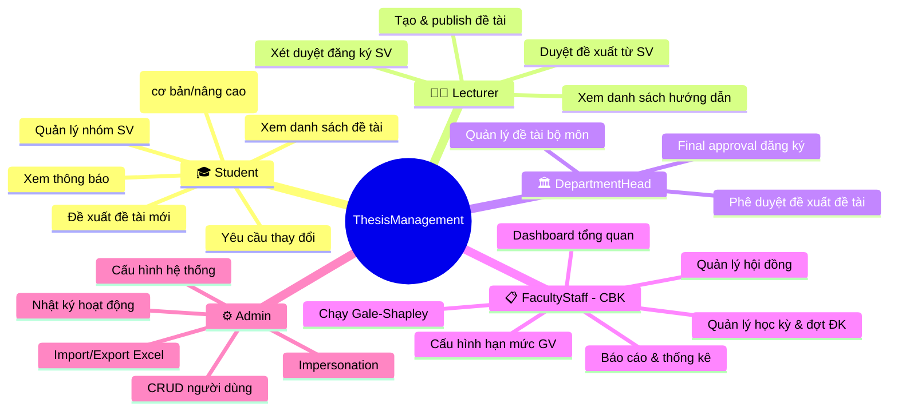

### Bảng quyền chi tiết

| Chức năng | Student | Lecturer | DeptHead | CBK | Admin |
|-----------|:-------:|:--------:|:--------:|:---:|:-----:|
| Đăng nhập Google SSO | ✅ | ✅ | ✅ | ✅ | ❌ |
| Đăng nhập Local (Email/Pass) | ❌ | ❌ | ❌ | ❌ | ✅ |
| Chuyển đổi vai trò (Switch Role) | ✅ | ✅ | ✅ | ✅ | ✅ |
| Xem danh sách đề tài | ✅ | ✅ | ✅ | ✅ | ❌ |
| Đăng ký đề tài | ✅ | ❌ | ❌ | ❌ | ❌ |
| Tạo đề tài | ❌ | ✅ | ❌ | ❌ | ❌ |
| Xét duyệt đăng ký | ❌ | ✅ | ❌ | ❌ | ❌ |
| Phê duyệt cấp cuối | ❌ | ❌ | ✅ | ✅ | ❌ |
| Phê duyệt đề xuất (TBM) | ❌ | ❌ | ✅ | ❌ | ❌ |
| Chạy Gale-Shapley | ❌ | ❌ | ❌ | ✅ | ❌ |
| Quản lý hội đồng | ❌ | ❌ | ❌ | ✅ | ❌ |
| Quản lý user | ❌ | ❌ | ❌ | ❌ | ✅ |
| System Config | ❌ | ❌ | ❌ | ❌ | ✅ |
| Impersonation | ❌ | ❌ | ❌ | ❌ | ✅ |

---

## 3. Sitemap Tổng Thể

```mermaid
graph TD
    LOGIN["/login<br>🔐 Trang đăng nhập"]

    LOGIN --> STU_DASH
    LOGIN --> LEC_DASH
    LOGIN --> DEPT_DASH
    LOGIN --> CBK_DASH
    LOGIN --> ADM_USERS

    subgraph "🎓 Student Portal"
        STU_DASH["/student/dashboard<br>📊 Dashboard SV"]
        STU_TOPICS["/student/topics<br>📚 Danh sách đề tài"]
        STU_TOPIC_DET["/student/topics/:id<br>📝 Chi tiết đề tài"]
        STU_REG["/student/registrations<br>📋 Đăng ký của tôi"]
        STU_REGISTER["/student/register<br>✏️ Đăng ký đề tài"]
        STU_PROPOSE["/student/propose<br>💡 Đề xuất đề tài"]
        STU_GROUP["/student/group<br>👥 Nhóm của tôi"]
        STU_CHANGE["/student/change-requests<br>🔄 Yêu cầu thay đổi"]

        STU_DASH --> STU_TOPICS
        STU_TOPICS --> STU_TOPIC_DET
        STU_TOPIC_DET --> STU_REGISTER
        STU_DASH --> STU_REG
        STU_DASH --> STU_PROPOSE
        STU_DASH --> STU_GROUP
        STU_DASH --> STU_CHANGE
    end

    subgraph "👨‍🏫 Lecturer Portal"
        LEC_DASH["/lecturer/dashboard<br>📊 Dashboard GV"]
        LEC_TOPICS["/lecturer/topics<br>📚 Đề tài của tôi"]
        LEC_PENDING["/lecturer/pending<br>⏳ Chờ xét duyệt"]
        LEC_PROPOSALS["/lecturer/proposals<br>💡 Đề xuất từ SV"]

        LEC_DASH --> LEC_TOPICS
        LEC_DASH --> LEC_PENDING
        LEC_DASH --> LEC_PROPOSALS
    end

    subgraph "🏛️ Department Head Portal"
        DEPT_DASH["/dept/dashboard<br>📊 Dashboard TBM"]
        DEPT_PROP["/dept/proposals<br>💡 Duyệt đề xuất"]
        DEPT_FINAL["/dept/final-approval<br>✅ Phê duyệt cuối"]
        DEPT_TOPICS["/dept/topics<br>📚 Đề tài bộ môn"]

        DEPT_DASH --> DEPT_PROP
        DEPT_DASH --> DEPT_FINAL
        DEPT_DASH --> DEPT_TOPICS
    end

    subgraph "📋 CBK Portal (Faculty Staff)"
        CBK_DASH["/cbk/dashboard<br>📊 Dashboard tổng quan"]
        CBK_SEM["/cbk/semesters<br>📅 Quản lý học kỳ"]
        CBK_PERIOD["/cbk/periods<br>📋 Đợt đăng ký"]
        CBK_QUOTA["/cbk/quotas<br>📊 Hạn mức GV"]
        CBK_GS["/cbk/assignment<br>🤖 Gale-Shapley"]
        CBK_COMM["/cbk/committees<br>🏛️ Hội đồng chấm"]
        CBK_REPORT["/cbk/reports<br>📈 Báo cáo"]

        CBK_DASH --> CBK_SEM
        CBK_DASH --> CBK_PERIOD
        CBK_DASH --> CBK_QUOTA
        CBK_DASH --> CBK_GS
        CBK_DASH --> CBK_COMM
        CBK_DASH --> CBK_REPORT
    end

    subgraph "⚙️ Admin Portal"
        ADM_USERS["/admin/users<br>👤 Quản lý user"]
        ADM_IMPORT["/admin/import<br>📥 Import/Export"]
        ADM_CONFIG["/admin/config<br>⚙️ Cấu hình"]
        ADM_AUDIT["/admin/audit<br>📜 Nhật ký"]
        ADM_IMP["/admin/impersonate<br>🔑 Impersonation"]

        ADM_USERS --> ADM_IMPORT
        ADM_USERS --> ADM_CONFIG
        ADM_USERS --> ADM_AUDIT
        ADM_USERS --> ADM_IMP
    end

    subgraph "🔔 Shared"
        NOTIF["/notifications<br>🔔 Thông báo"]
        PROFILE["/profile<br>👤 Hồ sơ cá nhân"]
    end
```

---

## 4. Luồng Nghiệp Vụ Chính

### 4.1. 🔐 Luồng Đăng nhập & Phân quyền

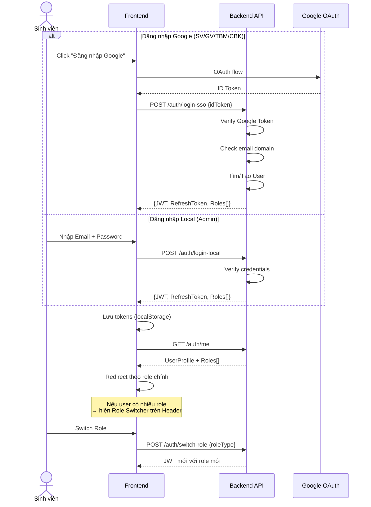

> [!IMPORTANT]
> **1 User có thể có nhiều Role.** Ví dụ: một GV đồng thời là Trưởng bộ môn → có cả role `Lecturer` và `DepartmentHead`. User chuyển đổi vai trò qua Role Switcher trên header mà **không cần đăng nhập lại**.

---

### 4.2. 📝 Luồng Đăng ký Đề tài (Core Business)

Đây là **luồng nghiệp vụ phức tạp nhất** của hệ thống. Có 2 chế độ đăng ký:

#### Chế độ Cơ bản (1 đề tài)
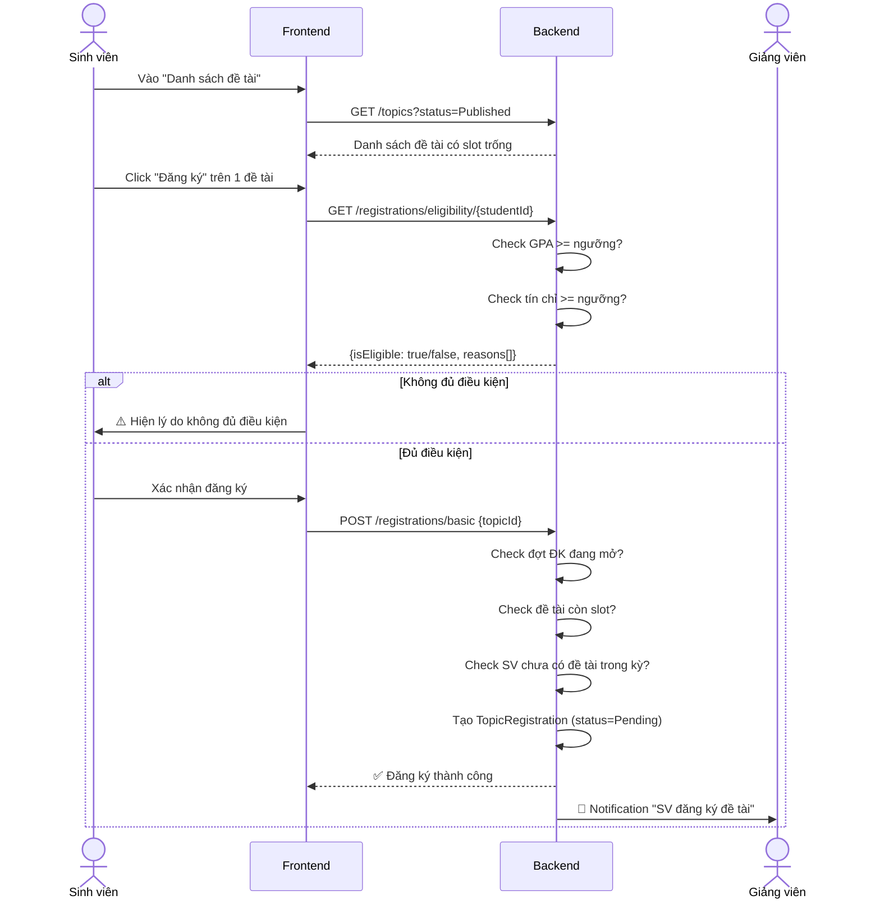

#### Chế độ Nâng cao (3 nguyện vọng)
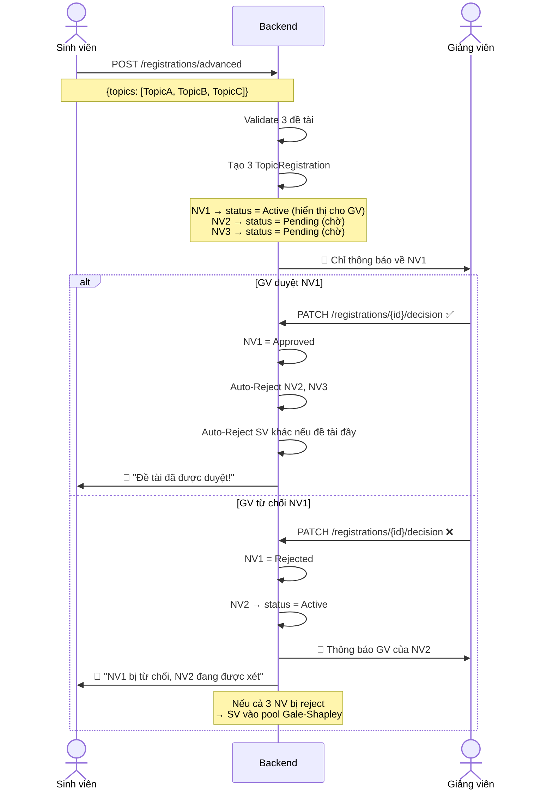

> [!WARNING]
> **Cascade logic khi xét duyệt:**
> - Approve NV1 → Auto-Reject NV2, NV3 của SV + Auto-Reject SV khác nếu đề tài hết slot
> - Reject NV1 → Tự động kích hoạt NV2 cho GV xét
> - Reject tất cả 3 NV → SV rơi vào pool "chưa có đề tài" để chạy Gale-Shapley

---

### 4.3. 🤖 Luồng Gale-Shapley (Phân công tự động)

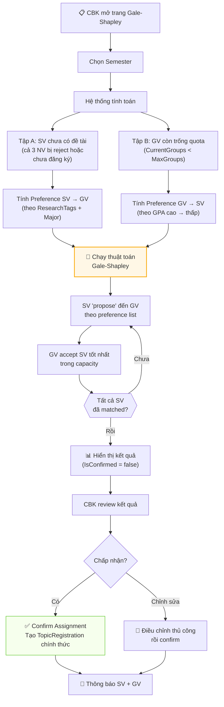

> [!NOTE]
> **Gale-Shapley** là thuật toán "Stable Matching" - đảm bảo kết quả phân công ổn định (không có "blocking pair" - tức không có cặp SV-GV nào muốn chuyển sang nhau). CBK có thể review và điều chỉnh trước khi xác nhận.

---

### 4.4. 💡 Luồng Đề xuất Đề tài mới

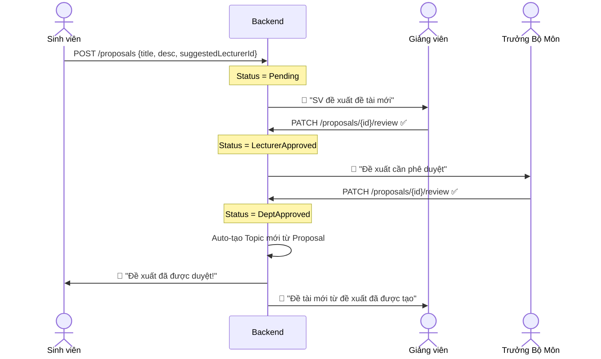

---

### 4.5. 👥 Luồng Quản lý Nhóm Sinh Viên

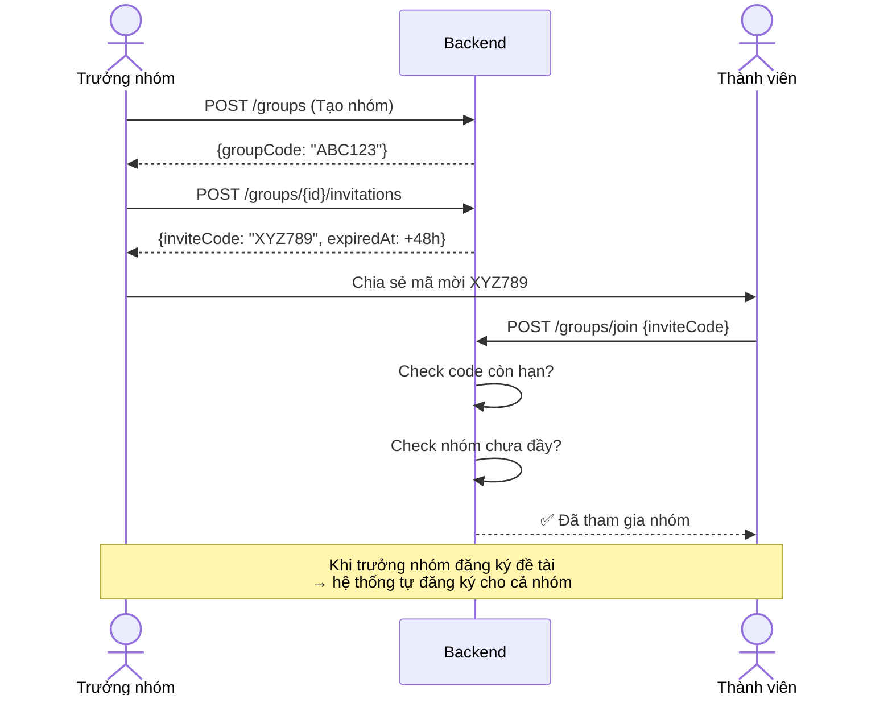

---

### 4.6. 🔄 Luồng Yêu cầu Thay đổi

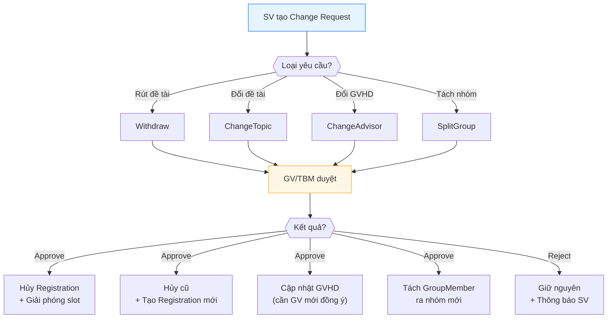

---

### 4.7. 🏛️ Luồng Xét duyệt Cascade (Đề tài 2)

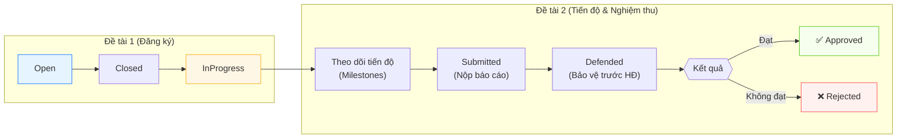

---

## 5. Chi Tiết Từng Màn Hình

### 📱 Layout Chung (AppLayout)

```
┌──────────────────────────────────────────────────────────────────┐
│ ┌──────────┐  ┌────────────────────────────────────────────────┐ │
│ │          │  │ HEADER (h=64px)                                │ │
│ │          │  │ ┌─Breadcrumb────┐  ┌─Role Switcher─┐ 🔔 👤   │ │
│ │  SIDEBAR │  │ └───────────────┘  └───────────────┘           │ │
│ │ (w=260px)│  ├────────────────────────────────────────────────┤ │
│ │          │  │                                                │ │
│ │ 🎓 Logo  │  │              CONTENT AREA                     │ │
│ │          │  │                                                │ │
│ │ ─────── │  │         (React Router Outlet)                  │ │
│ │ 📊 Dash  │  │                                                │ │
│ │ 📚 Topics│  │                                                │ │
│ │ 📝 Regs  │  │                                                │ │
│ │ 💡 Prop  │  │                                                │ │
│ │ 👥 Group │  │                                                │ │
│ │ 🔄 Change│  │                                                │ │
│ │ 🔔 Notif │  │                                                │ │
│ │          │  │                                                │ │
│ │          │  │                                                │ │
│ └──────────┘  └────────────────────────────────────────────────┘ │
└──────────────────────────────────────────────────────────────────┘
```

> **Sidebar:** Menu thay đổi theo role. Collapsible trên mobile (width=80px).
> **Header:** Breadcrumb auto-generate, Role Switcher, Notification Bell (badge), Avatar dropdown.

---

### 🔐 Screen 1: Trang Đăng nhập (`/login`)

```
┌──────────────────────────────────────────────────────────────────┐
│                                                                  │
│  ┌────────────────────────┐  ┌────────────────────────────────┐ │
│  │                        │  │                                │ │
│  │   🎓                   │  │     ╔═══════════════════╗      │ │
│  │                        │  │     ║   Đăng nhập       ║      │ │
│  │  HỆ THỐNG QUẢN LÝ     │  │     ╚═══════════════════╝      │ │
│  │  KHÓA LUẬN TỐT NGHIỆP │  │                                │ │
│  │                        │  │  ┌──────────────────────────┐  │ │
│  │  Đăng ký, xét duyệt   │  │  │ 🌐 Đăng nhập bằng Google│  │ │
│  │  và điều phối đề tài   │  │  └──────────────────────────┘  │ │
│  │                        │  │                                │ │
│  │                        │  │  ─────────── hoặc ──────────── │ │
│  │  ● ● ●                │  │                                │ │
│  │  Gradient Background   │  │  📧 Email                      │ │
│  │  #1677ff → #722ed1     │  │  ┌──────────────────────────┐  │ │
│  │                        │  │  │ admin@system.local       │  │ │
│  │                        │  │  └──────────────────────────┘  │ │
│  │                        │  │                                │ │
│  │                        │  │  🔒 Mật khẩu                   │ │
│  │                        │  │  ┌──────────────────────────┐  │ │
│  │                        │  │  │ ••••••••                 │  │ │
│  │                        │  │  └──────────────────────────┘  │ │
│  │                        │  │                                │ │
│  │                        │  │  ☑ Ghi nhớ đăng nhập           │ │
│  │                        │  │                                │ │
│  │                        │  │  ┌──────────────────────────┐  │ │
│  │                        │  │  │     ĐĂNG NHẬP            │  │ │
│  │                        │  │  └──────────────────────────┘  │ │
│  │                        │  │                                │ │
│  └────────────────────────┘  └────────────────────────────────┘ │
│                                                                  │
└──────────────────────────────────────────────────────────────────┘
```

**Logic nghiệp vụ:**
- Google Login: Dành cho SV, GV, TBM, CBK → OAuth flow → Verify email domain trường
- Local Login: Chỉ dành cho Admin (admin@system.local / Admin@123)
- Sau đăng nhập → Redirect theo role chính: Student→`/student/dashboard`, Lecturer→`/lecturer/dashboard`...
- Nếu có nhiều roles → dùng role đầu tiên, user switch sau trên Header

---

### 🎓 Screen 2: Dashboard Sinh viên (`/student/dashboard`)

```
┌──────────────────────────────────────────────────────────────────┐
│  Xin chào, Nguyễn Văn A! 👋                                     │
│                                                                  │
│  ┌───────────────┐  ┌───────────────┐  ┌───────────────┐       │
│  │ 📄 Đề tài     │  │ 📊 Trạng thái │  │ 👥 Nhóm       │       │
│  │ đã đăng ký    │  │               │  │               │       │
│  │      2        │  │  ⏳ Đang chờ  │  │  Nhóm ABC123  │       │
│  │ (blue card)   │  │  (orange tag) │  │  3 thành viên │       │
│  └───────────────┘  └───────────────┘  └───────────────┘       │
│                                                                  │
│  Thao tác nhanh                                                  │
│  ┌──────────┐ ┌──────────┐ ┌──────────┐ ┌──────────┐          │
│  │ 📝       │ │ 💡       │ │ 👥       │ │ 🔔       │          │
│  │ Đăng ký  │ │ Đề xuất  │ │ Quản lý  │ │ Thông    │          │
│  │ đề tài   │ │ đề tài   │ │ nhóm     │ │ báo      │          │
│  └──────────┘ └──────────┘ └──────────┘ └──────────┘          │
│                                                                  │
│  🔔 Thông báo gần đây                                           │
│  ├─ ✅ Đăng ký NV1 đã được duyệt — 2 phút trước               │
│  ├─ ⚠️ Còn 2 ngày đóng đợt đăng ký — 1 giờ trước              │
│  ├─ ❌ NV2 bị từ chối: "Đề tài đã đầy" — Hôm qua              │
│  └─ 📢 Đợt đăng ký HK1 đã mở — 3 ngày trước                   │
│                                                                  │
└──────────────────────────────────────────────────────────────────┘
```

**Logic nghiệp vụ:**
- Stat cards hiển thị thông tin tổng quan từ API `GET /registrations/student/{id}/registrations`
- Quick actions dẫn đến các trang tương ứng
- Thông báo gần nhất từ `GET /notifications?pageSize=5`

---

### 📚 Screen 3: Danh sách Đề tài (`/student/topics`)

```
┌──────────────────────────────────────────────────────────────────┐
│  📚 Danh sách Đề tài KLTN                    [Grid 🔲] [List ≡] │
│                                                                  │
│  Filter: [Lĩnh vực ▼] [Bộ môn ▼] [🔍 Tìm kiếm...     ] [Lọc] │
│                                                                  │
│  ┌──────────────────┐  ┌──────────────────┐  ┌────────────────┐ │
│  │ AI Chatbot cho   │  │ Hệ thống quản lý │  │ App di động    │ │
│  │ giáo dục    🟢   │  │ thư viện    🟢   │  │ sức khỏe  🔴  │ │
│  │                  │  │                  │  │                │ │
│  │ 👨‍🏫 GV: Nguyễn A  │  │ 👨‍🏫 GV: Trần B    │  │ 👨‍🏫 GV: Lê C    │ │
│  │ 🏷️ AI/ML         │  │ 🏷️ Web Dev       │  │ 🏷️ Mobile      │ │
│  │ 📝 Xây dựng hệ   │  │ 📝 Phát triển    │  │ 📝 Thiết kế    │ │
│  │ thống chatbot... │  │ phần mềm quản...│  │ ứng dụng...   │ │
│  │                  │  │                  │  │                │ │
│  │ ▓▓▓▓▓░░░ 2/3 SV │  │ ▓▓▓▓▓▓▓▓ ĐẦY    │  │ ▓░░░░░░░ 1/5  │ │
│  │                  │  │                  │  │                │ │
│  │ [  Xem chi tiết ]│  │ [  Đã đầy  🔒  ]│  │ [  Xem chi tiết]│ │
│  └──────────────────┘  └──────────────────┘  └────────────────┘ │
│                                                                  │
│                    ◀ 1  2  3  ... 10 ▶                          │
└──────────────────────────────────────────────────────────────────┘
```

**Logic nghiệp vụ:**
- API: `GET /topics?status=Published&fieldId=...&deptId=...&search=...&page=1&pageSize=9`
- Toggle Grid/Table view
- Card hiển thị: Tên, GV, Lĩnh vực, Mô tả (truncate), Progress slot
- 🟢 = còn chỗ, 🔴 = đã đầy → disable nút đăng ký
- Hover effect: shadow tăng + scale 1.02

---

### 📝 Screen 4: Chi tiết Đề tài (`/student/topics/:id`)

```
┌──────────────────────────────────────────────────────────────────┐
│  📚 Đề tài > AI Chatbot cho giáo dục                            │
│                                                                  │
│  ╔══════════════════════════════════════════════════════════╗    │
│  ║  AI Chatbot cho giáo dục                    [🟢 Mở ĐK] ║    │
│  ╠══════════════════════════════════════════════════════════╣    │
│  ║  👨‍🏫 GV hướng dẫn:  Nguyễn Văn A                        ║    │
│  ║  🏷️ Lĩnh vực:      AI/ML                               ║    │
│  ║  🏢 Bộ môn:        Công nghệ phần mềm                  ║    │
│  ║  👥 Số SV tối đa:  3  (còn trống: 1)                   ║    │
│  ║  📅 Học kỳ:        HK1 2025-2026                       ║    │
│  ╚══════════════════════════════════════════════════════════╝    │
│                                                                  │
│  ┌─────────┬──────────┬───────────────┬──────────┐              │
│  │  Mô tả  │ Yêu cầu  │ Đã đăng ký(2) │ Nhóm SV  │              │
│  ├─────────┴──────────┴───────────────┴──────────┤              │
│  │                                                │              │
│  │  Xây dựng hệ thống chatbot sử dụng LLM để    │              │
│  │  hỗ trợ sinh viên trong quá trình học tập.    │              │
│  │  Chatbot có thể trả lời câu hỏi, giải thích  │              │
│  │  bài tập, và đưa ra lộ trình học phù hợp.    │              │
│  │                                                │              │
│  └────────────────────────────────────────────────┘              │
│                                                                  │
│  ┌────────────────────┐  ┌──────────────────────┐               │
│  │ ✏️ Đăng ký đề tài   │  │ ⭐ Thêm vào nguyện vọng│               │
│  └────────────────────┘  └──────────────────────┘               │
└──────────────────────────────────────────────────────────────────┘
```

**Logic nghiệp vụ:**
- API: `GET /topics/{id}` → Thông tin chi tiết + GV + slot
- Tabs: Mô tả, Yêu cầu, Danh sách SV đã đăng ký, Nhóm SV
- Nút "Đăng ký" → gọi `POST /registrations/basic` (mode cơ bản)
- Nút "Thêm vào nguyện vọng" → lưu local, dùng khi đăng ký mode nâng cao
- Disable nếu đề tài đã đầy

---

### 📋 Screen 5: Đăng ký của tôi (`/student/registrations`)

```
┌──────────────────────────────────────────────────────────────────┐
│  📋 Đăng ký của tôi — HK1 2025-2026                             │
│                                                                  │
│  ┌── Nguyện vọng 1 ─────────────────────────────────────────┐   │
│  │ ⭐ AI Chatbot cho giáo dục                                │   │
│  │    GV: Nguyễn Văn A                                       │   │
│  │    Đăng ký: 15/03/2026                                    │   │
│  │    Trạng thái: [✅ ĐÃ DUYỆT]     ← highlight xanh       │   │
│  │    ──── (Duyệt bởi GV Nguyễn Văn A vào 16/03/2026) ──── │   │
│  └───────────────────────────────────────────────────────────┘   │
│          │                                                       │
│          ▼                                                       │
│  ┌── Nguyện vọng 2 ─────────────────────────────────────────┐   │
│  │    Hệ thống quản lý thư viện                              │   │
│  │    GV: Trần Thị B                                         │   │
│  │    Trạng thái: [❌ TỰ ĐỘNG HỦY]   ← highlight xám       │   │
│  │    Lý do: "SV đã được duyệt ở NV1"                       │   │
│  └───────────────────────────────────────────────────────────┘   │
│          │                                                       │
│          ▼                                                       │
│  ┌── Nguyện vọng 3 ─────────────────────────────────────────┐   │
│  │    App di động sức khỏe                                   │   │
│  │    GV: Lê Văn C                                           │   │
│  │    Trạng thái: [❌ TỰ ĐỘNG HỦY]   ← highlight xám       │   │
│  │    Lý do: "SV đã được duyệt ở NV1"                       │   │
│  └───────────────────────────────────────────────────────────┘   │
│                                                                  │
└──────────────────────────────────────────────────────────────────┘
```

**Logic nghiệp vụ:**
- API: `GET /registrations/student/{studentId}/registrations`
- Hiển thị dạng Timeline/Steps vertical
- NV được duyệt: highlight xanh + confetti animation
- NV bị từ chối: ghi lý do, highlight đỏ nhạt
- NV tự động hủy: highlight xám

---

### 👥 Screen 6: Quản lý Nhóm (`/student/group`)

```
┌──────────────────────────────────────────────────────────────────┐
│  👥 Nhóm của tôi                                                 │
│                                                                  │
│  ╔══════════════════════════════════════════════════════════╗    │
│  ║  Nhóm: ABC123                        [📋 Tạo mã mời]   ║    │
│  ╠══════════════════════════════════════════════════════════╣    │
│  ║                                                          ║    │
│  ║  👤 Nguyễn Văn A       ⭐ Trưởng nhóm                   ║    │
│  ║  👤 Trần Thị B         Thành viên          [🗑️ Xóa]    ║    │
│  ║  👤 Lê Văn C           Thành viên          [🗑️ Xóa]    ║    │
│  ║                                                          ║    │
│  ╠══════════════════════════════════════════════════════════╣    │
│  ║  📧 Mã mời đang hoạt động:                              ║    │
│  ║  ┌──────────────────────────────────────────────────┐   ║    │
│  ║  │  XYZ789          ⏰ Hết hạn: 20/03 14:00  [📋]  │   ║    │
│  ║  └──────────────────────────────────────────────────┘   ║    │
│  ║                                                          ║    │
│  ║  💡 Chia sẻ mã mời cho bạn nhóm                         ║    │
│  ╠══════════════════════════════════════════════════════════╣    │
│  ║  Tham gia nhóm khác:                                    ║    │
│  ║  ┌─────────────────────────┐  ┌──────────┐             ║    │
│  ║  │ Nhập mã mời...         │  │ Tham gia  │             ║    │
│  ║  └─────────────────────────┘  └──────────┘             ║    │
│  ╚══════════════════════════════════════════════════════════╝    │
│                                                                  │
│  ┌─── Chưa có nhóm? ───────────────────────────────────────┐   │
│  │  [🆕 Tạo nhóm mới]     hoặc    [📧 Nhập mã tham gia]   │   │
│  └──────────────────────────────────────────────────────────┘   │
└──────────────────────────────────────────────────────────────────┘
```

---

### 👨‍🏫 Screen 7: Dashboard Giảng viên (`/lecturer/dashboard`)

```
┌──────────────────────────────────────────────────────────────────┐
│  📊 Dashboard Giảng viên — HK1 2025-2026                         │
│                                                                  │
│  ┌─────────────┐ ┌──────────────┐ ┌─────────────┐ ┌──────────┐ │
│  │ 📚 Đề tài   │ │ ⏳ Chờ duyệt │ │ 💡 Đề xuất  │ │ 📊 Quota │ │
│  │ hướng dẫn   │ │              │ │ từ SV       │ │          │ │
│  │      5      │ │      3 ⚠️    │ │      1      │ │   5/8    │ │
│  │             │ │ (cần xử lý!) │ │             │ │ ▓▓▓▓▓░░░ │ │
│  └─────────────┘ └──────────────┘ └─────────────┘ └──────────┘ │
│                                                                  │
│  📚 Đề tài của tôi                                               │
│  ┌──────────────────────────────────────────────────────────┐   │
│  │ # │ Tên đề tài               │ Status  │ SV  │ Actions  │   │
│  │ 1 │ AI Chatbot giáo dục      │ 🟢 Open │ 2/3 │ [Xem]   │   │
│  │ 2 │ Hệ thống IoT nhà thông..│ 📝 Draft│ 0/2 │ [Publish]│   │
│  │ 3 │ Web scraping engine      │ 🟢 Open │ 1/2 │ [Xem]   │   │
│  └──────────────────────────────────────────────────────────┘   │
│                                                                  │
│  ⏳ Đăng ký mới nhất (chờ duyệt)                                │
│  ├─ Trần B → "AI Chatbot" — NV1 — 2 giờ trước                  │
│  ├─ Lê C → "Web scraping" — NV1 — 5 giờ trước                  │
│  └─ Phạm D → "AI Chatbot" — NV2 — 1 ngày trước                │
└──────────────────────────────────────────────────────────────────┘
```

**Logic nghiệp vụ:**
- Stat card "Chờ duyệt" có badge warning nếu > 0
- Quota hiển thị dạng Progress circle
- Table đề tài: Nút "Publish" cho đề tài Draft
- List đăng ký mới: 5 pending gần nhất

---

### ✅ Screen 8: Xét duyệt Đăng ký (`/lecturer/pending`)

```
┌──────────────────────────────────────────────────────────────────┐
│  ⏳ Đăng ký chờ xét duyệt                [Đề tài: Tất cả ▼]    │
│                                                                  │
│  ┌──────────────────────────────────────────────────────────┐   │
│  │ # │ Sinh viên    │ MSSV    │ Đề tài       │ NV │ GPA │ │   │
│  │───┼──────────────┼─────────┼──────────────┼────┼─────┼─│   │
│  │ 1 │ 👤 Trần B    │ SE12345 │ AI Chatbot   │ 1  │ 3.5 │ │   │
│  │   │              │         │              │    │     │ │   │
│  │   │  [✅ Duyệt]  [❌ Từ chối]                          │   │
│  │───┼──────────────┼─────────┼──────────────┼────┼─────┼─│   │
│  │ 2 │ 👤 Phạm D    │ SE67890 │ AI Chatbot   │ 2  │ 3.2 │ │   │
│  │   │              │         │              │    │     │ │   │
│  │   │  [✅ Duyệt]  [❌ Từ chối]                          │   │
│  │───┼──────────────┼─────────┼──────────────┼────┼─────┼─│   │
│  │ 3 │ 👤 Lê C      │ SE11111 │ Web scraping │ 1  │ 3.8 │ │   │
│  │   │              │         │              │    │     │ │   │
│  │   │  [✅ Duyệt]  [❌ Từ chối]                          │   │
│  └──────────────────────────────────────────────────────────┘   │
│                                                                  │
│  ┌─── Modal: Từ chối đăng ký ──────────────────────────────┐   │
│  │  Sinh viên: Phạm D — Đề tài: AI Chatbot                 │   │
│  │                                                           │   │
│  │  Lý do từ chối: *                                        │   │
│  │  ┌───────────────────────────────────────────────────┐   │   │
│  │  │ Đề tài đã đủ số lượng SV...                      │   │   │
│  │  └───────────────────────────────────────────────────┘   │   │
│  │                                                           │   │
│  │  [Hủy]                        [Xác nhận từ chối]         │   │
│  └───────────────────────────────────────────────────────────┘   │
└──────────────────────────────────────────────────────────────────┘
```

**Logic nghiệp vụ quan trọng khi duyệt:**
1. **Approve:** 
   - Cập nhật status = Approved
   - Auto-Reject các SV khác nếu đề tài hết slot
   - Auto-Reject các NV khác của SV này
   - Tạo Notification cho SV
2. **Reject:**
   - Cập nhật status = Rejected + lý do
   - Tìm NV tiếp theo → chuyển Active
   - Notification cho SV

---

### 📚 Screen 9: Đề tài của tôi - GV (`/lecturer/topics`)

```
┌──────────────────────────────────────────────────────────────────┐
│  📚 Đề tài của tôi              [+ Tạo đề tài mới]             │
│                                                                  │
│  ┌── AI Chatbot cho giáo dục ──── [🟢 Published] ──────────┐   │
│  │  👥 2/3 SV   │   🏷️ AI/ML   │  📅 HK1 2025-2026        │   │
│  │                                                           │   │
│  │  ▼ Danh sách SV đã đăng ký:                              │   │
│  │  ┌────────────────────────────────────────────────────┐   │   │
│  │  │ Trần B (SE12345)    │ NV1 │ ✅ Approved │ 15/03   │   │   │
│  │  │ Lê C (SE11111)      │ NV1 │ ⏳ Pending  │ 16/03   │   │   │
│  │  └────────────────────────────────────────────────────┘   │   │
│  └───────────────────────────────────────────────────────────┘   │
│                                                                  │
│  ┌── Hệ thống IoT nhà thông minh ── [📝 Draft] ────────────┐   │
│  │  👥 0/2 SV   │   🏷️ IoT     │  📅 HK1 2025-2026        │   │
│  │                                          [🚀 Publish]    │   │
│  └───────────────────────────────────────────────────────────┘   │
│                                                                  │
│  ┌── Modal: Tạo đề tài mới ────────────────────────────────┐   │
│  │  Tên đề tài: *        [                              ]   │   │
│  │  Lĩnh vực: *          [Select ▼                      ]   │   │
│  │  Mô tả:               [textarea                      ]   │   │
│  │  Yêu cầu:             [textarea                      ]   │   │
│  │  Số SV tối đa: *      [3                             ]   │   │
│  │                                                           │   │
│  │  [Hủy]                [Lưu nháp]     [Tạo & Publish]    │   │
│  └───────────────────────────────────────────────────────────┘   │
└──────────────────────────────────────────────────────────────────┘
```

**Logic nghiệp vụ:**
- GV chỉ tạo đề tài nếu còn quota (CurrentGroups < MaxGroups)
- Đề tài Draft → cần Publish mới hiện cho SV
- Chỉ Publish trong đợt đăng ký active

---

### 🏛️ Screen 10: Dashboard Trưởng Bộ Môn (`/dept/dashboard`)

```
┌──────────────────────────────────────────────────────────────────┐
│  🏛️ Dashboard Trưởng Bộ Môn — Bộ môn CNTT                      │
│                                                                  │
│  ┌─────────────┐ ┌──────────────┐ ┌──────────────┐             │
│  │ 💡 Đề xuất  │ │ ✅ Chờ Final │ │ 📚 Tổng đề   │             │
│  │ chờ duyệt   │ │ Approval     │ │ tài bộ môn   │             │
│  │      2      │ │      5       │ │      18      │             │
│  └─────────────┘ └──────────────┘ └──────────────┘             │
│                                                                  │
│  📋 Danh sách cần xử lý                                         │
│  ┌──────────────────────────────────────────────────────────┐   │
│  │ # │ Loại        │ Nội dung            │ SV/GV   │ Action│   │
│  │ 1 │ 💡 Đề xuất  │ "App AI sức khỏe"   │ Trần B  │ [Xem] │   │
│  │ 2 │ ✅ Final    │ "AI Chatbot giáo dục"│ Nguyễn A│ [Xem] │   │
│  │ 3 │ 💡 Đề xuất  │ "IoT cho nông nghiệp"│ Lê C   │ [Xem] │   │
│  └──────────────────────────────────────────────────────────┘   │
└──────────────────────────────────────────────────────────────────┘
```

---

### ✅ Screen 11: Phê duyệt cấp cuối (`/dept/final-approval`)

```
┌──────────────────────────────────────────────────────────────────┐
│  ✅ Phê duyệt cấp cuối                                          │
│                                                                  │
│  Đăng ký đã được GV duyệt, cần TBM phê duyệt cuối:            │
│                                                                  │
│  ┌──────────────────────────────────────────────────────────┐   │
│  │ # │ SV          │ Đề tài          │ GV duyệt  │ Actions │   │
│  │ 1 │ Trần B      │ AI Chatbot      │ ✅ Nguyễn A│ [✅][❌]│   │
│  │ 2 │ Phạm D      │ Web scraping    │ ✅ Trần B  │ [✅][❌]│   │
│  │ 3 │ Hoàng E     │ App di động     │ ✅ Lê C    │ [✅][❌]│   │
│  └──────────────────────────────────────────────────────────┘   │
│                                                                  │
│  💡 Duyệt cuối → Đăng ký chính thức xác nhận                   │
└──────────────────────────────────────────────────────────────────┘
```

**Logic nghiệp vụ:**
- Đây là bước phê duyệt **cấp 2** sau khi GV đã approve
- TBM approve → RegistrationStatus = FinalApproved
- TBM reject → Quay lại trạng thái trước

---

### 📊 Screen 12: Dashboard CBK (`/cbk/dashboard`)

```
┌──────────────────────────────────────────────────────────────────┐
│  📊 Dashboard Tổng quan          [Học kỳ: HK1 2025-2026 ▼]     │
│                                                                  │
│  ┌─────────────┐ ┌──────────────┐ ┌─────────────┐ ┌──────────┐ │
│  │ 🎓 Tổng SV  │ │ ✅ Đã phân   │ │ ⏳ Chưa phân│ │ ⚠️ Bất   │ │
│  │ đăng ký     │ │ công         │ │ công        │ │ thường   │ │
│  │    156      │ │     120      │ │     28      │ │     8    │ │
│  │  ▲ +12%     │ │  ▲ +8%      │ │  ▼ -5%     │ │  ▲ +3   │ │
│  │ (blue grad) │ │ (green grad) │ │(orange grad)│ │(red grad)│ │
│  └─────────────┘ └──────────────┘ └─────────────┘ └──────────┘ │
│                                                                  │
│  ┌───────────────────────────┐ ┌───────────────────────────────┐│
│  │ 🥧 Phân bố theo lĩnh vực │ │ 📊 Tải giảng viên             ││
│  │                           │ │                               ││
│  │      ╭─────╮             │ │  ▐█▌   ← GV Nguyễn (5/8)     ││
│  │    ╱AI/ML 35%╲           │ │  ▐████▌← GV Trần (8/8) ĐẦY!  ││
│  │   │  Web 25%  │          │ │  ▐██▌  ← GV Lê (3/6)         ││
│  │   │ IoT 20%   │          │ │  ▐█▌   ← GV Phạm (2/5)       ││
│  │    ╲Mobile 20%╱          │ │  ───── quota line ─────       ││
│  │      ╰─────╯             │ │                               ││
│  └───────────────────────────┘ └───────────────────────────────┘│
│                                                                  │
│  ⚠️ Bất thường cần xử lý                                        │
│  ┌──────────────────────────────────────────────────────────┐   │
│  │ # │ Loại            │ Chi tiết                │ Severity │   │
│  │ 1 │ GV vượt quota   │ GV Trần B: 8/8 nhóm    │ 🔴 Cao  │   │
│  │ 2 │ SV chưa có ĐT   │ 28 SV cần phân công    │ 🟡 TB   │   │
│  │ 3 │ ĐT chưa có GV   │ "IoT nhà TM" thiếu GV  │ 🔴 Cao  │   │
│  └──────────────────────────────────────────────────────────┘   │
└──────────────────────────────────────────────────────────────────┘
```

**Logic nghiệp vụ:**
- API: `GET /dashboard/overview`, `/lecturer-load`, `/topic-distribution`, `/anomalies`
- Semester Selector filter toàn bộ data
- Stat cards có gradient background + trend indicator
- Pie chart: Phân bố đề tài theo TopicField
- Bar chart: Số nhóm mỗi GV vs. quota line

---

### 🤖 Screen 13: Gale-Shapley (`/cbk/assignment`)

```
┌──────────────────────────────────────────────────────────────────┐
│  🤖 Phân công tự động Gale-Shapley                               │
│                                                                  │
│  Step 1: Cấu hình ━━━━━━● Step 2: Xem trước ━━━━○ Step 3: ○   │
│                                                                  │
│  ┌── Step 1: Cấu hình ─────────────────────────────────────┐   │
│  │                                                           │   │
│  │  Học kỳ: [HK1 2025-2026 ▼]                              │   │
│  │                                                           │   │
│  │  📊 Thống kê:                                            │   │
│  │  • SV chưa có đề tài: 28 sinh viên                      │   │
│  │  • GV còn trống quota: 12 giảng viên                     │   │
│  │  • Tổng slot trống: 35                                    │   │
│  │                                                           │   │
│  │  ┌── SV chưa phân công ─────┐ ┌── GV còn quota ────────┐│   │
│  │  │ Trần B (GPA: 3.5)       │ │ GV Nguyễn (3 slot)     ││   │
│  │  │ Lê C (GPA: 3.8)         │ │ GV Phạm (3 slot)       ││   │
│  │  │ Hoàng D (GPA: 3.2)      │ │ GV Vũ (2 slot)         ││   │
│  │  │ ... (28 SV)             │ │ ... (12 GV)            ││   │
│  │  └──────────────────────────┘ └─────────────────────────┘│   │
│  │                                                           │   │
│  │  [🤖 Chạy thuật toán Gale-Shapley]                       │   │
│  └───────────────────────────────────────────────────────────┘   │
│                                                                  │
│  ┌── Step 2: Kết quả (sau khi chạy) ───────────────────────┐   │
│  │                                                           │   │
│  │  ✅ Phân công thành công: 25/28 SV                       │   │
│  │  ⚠️ Chưa phân công được: 3 SV (thiếu slot GV)           │   │
│  │                                                           │   │
│  │  ┌────────────────────────────────────────────────────┐   │   │
│  │  │ ☑ │ SV         │ GV được gán   │ Lý do           │   │   │
│  │  │ ☑ │ Lê C       │ GV Nguyễn     │ GPA cao + tag   │   │   │
│  │  │ ☑ │ Trần B     │ GV Phạm       │ Research match  │   │   │
│  │  │ ☑ │ Hoàng D    │ GV Vũ         │ GPA preference  │   │   │
│  │  │ ☐ │ Ngọc E     │ ❌ Không match │ Hết slot GV    │   │   │
│  │  └────────────────────────────────────────────────────┘   │   │
│  │                                                           │   │
│  │  [◀ Quay lại]              [Xác nhận phân công ▶]        │   │
│  └───────────────────────────────────────────────────────────┘   │
└──────────────────────────────────────────────────────────────────┘
```

**Logic nghiệp vụ chi tiết:**
1. **Tập A (SV):** Lấy SV chưa có đề tài trong semester (3 NV bị reject hoặc chưa đăng ký)
2. **Tập B (GV):** Lấy GV còn quota trống
3. **Preference SV→GV:** Ưu tiên GV có ResearchTags trùng Major SV
4. **Preference GV→SV:** Ưu tiên SV có GPA cao nhất
5. **Thuật toán:** SV "propose" → GV accept/reject theo capacity
6. **Kết quả:** IsConfirmed = false (chỉ đề xuất)
7. **Confirm:** CBK review → xác nhận → tạo TopicRegistration chính thức

---

### 📅 Screen 14: Quản lý Học kỳ (`/cbk/semesters`)

```
┌──────────────────────────────────────────────────────────────────┐
│  📅 Quản lý Học kỳ                          [+ Tạo học kỳ mới] │
│                                                                  │
│  ┌──────────────────────────────────────────────────────────┐   │
│  │ # │ Tên             │ Năm  │ Bắt đầu   │ Kết thúc  │Act│   │
│  │ 1 │ HK1 2025-2026   │ 2025 │ 01/09/25  │ 31/01/26 │ ✅│   │
│  │ 2 │ HK2 2024-2025   │ 2025 │ 01/02/25  │ 30/06/25 │ ❌│   │
│  │ 3 │ HK1 2024-2025   │ 2024 │ 01/09/24  │ 31/01/25 │ ❌│   │
│  └──────────────────────────────────────────────────────────┘   │
│                                                                  │
│  ✅ = Học kỳ đang active (chỉ 1 tại 1 thời điểm)              │
└──────────────────────────────────────────────────────────────────┘
```

---

### 📋 Screen 15: Đợt Đăng ký (`/cbk/periods`)

```
┌──────────────────────────────────────────────────────────────────┐
│  📋 Quản lý Đợt Đăng ký                 [+ Tạo đợt mới]       │
│                                                                  │
│  ┌──────────────────────────────────────────────────────────┐   │
│  │ # │ Tên đợt       │ Học kỳ  │ Mở      │ Đóng    │ Loại │   │
│  │ 1 │ Đợt ĐK KLTN 1 │ HK1 25 │ 01/10   │ 15/10   │ KLTN │   │
│  │   │                │         │         │         │ 🟢   │   │
│  │ 2 │ Đợt ĐK CD     │ HK1 25 │ 01/11   │ 15/11   │ CD   │   │
│  │   │                │         │         │         │ ⚪   │   │
│  └──────────────────────────────────────────────────────────┘   │
│                                                                  │
│  ⚠️ Chỉ 1 đợt Active tại 1 thời điểm cho mỗi loại            │
│  🟢 = Đang mở    ⚪ = Chưa mở    🔴 = Đã đóng                │
└──────────────────────────────────────────────────────────────────┘
```

---

### 📊 Screen 16: Hạn mức GV (`/cbk/quotas`)

```
┌──────────────────────────────────────────────────────────────────┐
│  📊 Hạn mức Giảng viên            [Học kỳ: HK1 2025-2026 ▼]   │
│                                                                  │
│  ┌──────────────────────────────────────────────────────────┐   │
│  │ # │ Giảng viên    │ Bộ môn │ Hiện tại │ Hạn mức │ Edit │   │
│  │ 1 │ GV Nguyễn A   │ CNTT   │ 5        │ 8       │ [✏️] │   │
│  │   │               │        │ ▓▓▓▓▓░░░ │         │      │   │
│  │ 2 │ GV Trần B     │ HTTT   │ 8        │ 8       │ [✏️] │   │
│  │   │               │        │ ▓▓▓▓▓▓▓▓ │ 🔴 ĐẦY! │      │   │
│  │ 3 │ GV Lê C       │ CNTT   │ 3        │ 6       │ [✏️] │   │
│  │   │               │        │ ▓▓▓░░░░░ │         │      │   │
│  │ 4 │ GV Phạm D     │ KHMT   │ 2        │ 5       │ [✏️] │   │
│  │   │               │        │ ▓▓░░░░░░ │         │      │   │
│  └──────────────────────────────────────────────────────────┘   │
│                                                                  │
│  Color coding: 🟢 Còn chỗ  🟡 Gần đầy (>80%)  🔴 Đầy/Vượt   │
└──────────────────────────────────────────────────────────────────┘
```

---

### 🏛️ Screen 17: Hội đồng chấm (`/cbk/committees`)

```
┌──────────────────────────────────────────────────────────────────┐
│  🏛️ Quản lý Hội đồng chấm               [+ Tạo hội đồng mới] │
│                                                                  │
│  ┌── HĐ AI & Machine Learning ───── 📅 20/06/2026 ─────────┐  │
│  │  📍 Phòng A301  │  📚 3 đề tài  │  👥 5 thành viên       │  │
│  │                                                           │  │
│  │  ▼ Thành viên:                                            │  │
│  │  ┌────────────────────────────────────────────────────┐   │  │
│  │  │ 👤 PGS.TS Nguyễn A  │ 🏅 Chủ tịch  (President)   │   │  │
│  │  │ 👤 TS. Trần B       │ 📝 Thư ký   (Secretary)    │   │  │
│  │  │ 👤 TS. Lê C         │ 👤 Thành viên (Member)      │   │  │
│  │  │ 👤 ThS. Phạm D      │ 🔍 Phản biện (Reviewer)    │   │  │
│  │  │ 👤 TS. Vũ E         │ 👁️ Quan sát  (Observer)    │   │  │
│  │  └────────────────────────────────────────────────────┘   │  │
│  │                                                           │  │
│  │  [+ Thêm thành viên]   [✏️ Sửa]   [🗑️ Xóa]             │  │
│  └───────────────────────────────────────────────────────────┘  │
│                                                                  │
│  ┌── HĐ Web Development ────── 📅 22/06/2026 ──────────────┐  │
│  │  📍 Phòng B202  │  📚 5 đề tài  │  👥 4 thành viên       │  │
│  │  [▶ Xem chi tiết]                                        │  │
│  └───────────────────────────────────────────────────────────┘  │
└──────────────────────────────────────────────────────────────────┘
```

**Logic nghiệp vụ:**
- CommitteeRole: President (Chủ tịch), Secretary (Thư ký), Member, Reviewer (Phản biện), Observer
- Mỗi hội đồng gán nhiều đề tài để chấm
- Thông báo tự động cho thành viên khi được gán

---

### 📈 Screen 18: Báo cáo & Thống kê (`/cbk/reports`)

```
┌──────────────────────────────────────────────────────────────────┐
│  📈 Báo cáo & Thống kê                                          │
│                                                                  │
│  ┌──────────┬──────────┬──────────┬──────────┐                  │
│  │ Đề tài   │ Đăng ký  │ Tải GV   │ Export   │                  │
│  └──────────┴──────────┴──────────┴──────────┘                  │
│                                                                  │
│  Filter: [Học kỳ ▼]  [Bộ môn ▼]                                │
│                                                                  │
│  ┌───────────────────────────┐ ┌───────────────────────────────┐│
│  │ 📊 Đề tài theo Bộ môn    │ │ 🥧 Tỷ lệ duyệt/từ chối      ││
│  │                           │ │                               ││
│  │  CNTT ▐████████▌ 12      │ │       Approved 72%            ││
│  │  HTTT ▐████▌ 6           │ │       Rejected 18%            ││
│  │  KHMT ▐██████▌ 9         │ │       Pending 10%             ││
│  │  KTPM ▐███▌ 4            │ │                               ││
│  └───────────────────────────┘ └───────────────────────────────┘│
│                                                                  │
│  Table chi tiết:                          [📥 Xuất Excel]       │
│  ┌──────────────────────────────────────────────────────────┐   │
│  │ Bộ môn │ Tổng ĐT │ SV ĐK │ Đã duyệt │ Từ chối │ Chờ  │   │
│  │ CNTT   │ 12      │ 35    │ 28       │ 5      │ 2    │   │
│  │ HTTT   │ 6       │ 15    │ 12       │ 2      │ 1    │   │
│  └──────────────────────────────────────────────────────────┘   │
└──────────────────────────────────────────────────────────────────┘
```

---

### 👤 Screen 19: Quản lý User - Admin (`/admin/users`)

```
┌──────────────────────────────────────────────────────────────────┐
│  👤 Quản lý người dùng         [+ Thêm mới]  [📥 Import Excel] │
│                                                                  │
│  Filter: [Role ▼] [Trạng thái ▼] [🔍 Tìm theo tên/email...]   │
│                                                                  │
│  ┌──────────────────────────────────────────────────────────┐   │
│  │ # │ 👤  │ Họ tên      │ Mã số   │ Email     │ Roles    │   │
│  │ 1 │ 🟢 │ Nguyễn A    │ SE12345 │ a@univ   │ 🎓 SV    │   │
│  │ 2 │ 🟢 │ Trần B      │ GV001   │ b@univ   │ 👨‍🏫GV 🏛TBM│   │
│  │ 3 │ 🔴 │ Lê C        │ SE67890 │ c@univ   │ 🎓 SV    │   │
│  │ 4 │ 🟢 │ admin       │ ADM001  │ admin@.. │ ⚙️ Admin │   │
│  └──────────────────────────────────────────────────────────┘   │
│                                                                  │
│  ┌── Import Modal ──────────────────────────────────────────┐   │
│  │  📂 Kéo thả file Excel vào đây                           │   │
│  │  ┌──────────────────────────────────────────────┐        │   │
│  │  │         ╔═══╗                                 │        │   │
│  │  │         ║📄║  Kéo file .xlsx vào đây          │        │   │
│  │  │         ╚═══╝  hoặc click để chọn file       │        │   │
│  │  └──────────────────────────────────────────────┘        │   │
│  │                                                           │   │
│  │  📋 Tải mẫu: [Template SV.xlsx] [Template GV.xlsx]       │   │
│  │                                                           │   │
│  │  ▓▓▓▓▓▓▓▓▓▓░░░░░ 65% đang import...                    │   │
│  │  ✅ 95 thành công  ❌ 5 lỗi                              │   │
│  │  Lỗi: Dòng 12 — Email trùng, Dòng 45 — Thiếu MSSV      │   │
│  └───────────────────────────────────────────────────────────┘   │
└──────────────────────────────────────────────────────────────────┘
```

**Logic nghiệp vụ:**
- Import Excel: Đọc file → Check trùng Email/MSSV → Skip hoặc Update
- Trả báo cáo import (success/fail count + danh sách lỗi)
- Assign Role: 1 user có thể có nhiều role
- 🟢 = Active, 🔴 = Bị khóa (Soft Delete)

---

### ⚙️ Screen 20: Cấu hình Hệ thống (`/admin/config`)

```
┌──────────────────────────────────────────────────────────────────┐
│  ⚙️ Cấu hình Hệ thống                                          │
│                                                                  │
│  ▼ Điều kiện đăng ký                                            │
│  ┌──────────────────────────────────────────────────────────┐   │
│  │  GPA tối thiểu:        [2.0        ] [💾 Lưu]           │   │
│  │  Tín chỉ tối thiểu:   [100        ] [💾 Lưu]           │   │
│  └──────────────────────────────────────────────────────────┘   │
│                                                                  │
│  ▼ Tiến độ & Milestone                                          │
│  ┌──────────────────────────────────────────────────────────┐   │
│  │  Ngày tối thiểu giữa các mốc:    [7   ] [💾 Lưu]       │   │
│  │  Ngày sau duyệt đến bảo vệ:      [30  ] [💾 Lưu]       │   │
│  └──────────────────────────────────────────────────────────┘   │
│                                                                  │
│  ▼ Chấm điểm                                                    │
│  ┌──────────────────────────────────────────────────────────┐   │
│  │  Điểm đạt tối thiểu:    [5.0      ] [💾 Lưu]           │   │
│  │  Trọng số mặc định:     [JSON...  ] [💾 Lưu]           │   │
│  └──────────────────────────────────────────────────────────┘   │
│                                                                  │
│  📜 [Xem lịch sử thay đổi cấu hình]                            │
└──────────────────────────────────────────────────────────────────┘
```

---

### 📜 Screen 21: Nhật ký Hoạt động (`/admin/audit`)

```
┌──────────────────────────────────────────────────────────────────┐
│  📜 Nhật ký hoạt động (Audit Log)                                │
│                                                                  │
│  Filter: [📅 Từ ngày...] [📅 Đến ngày...]                      │
│          [Table/Entity ▼] [User ▼]                               │
│                                                                  │
│  ┌──────────────────────────────────────────────────────────┐   │
│  │ Thời gian      │ User    │ Action  │ Table  │ Record    │   │
│  │ 26/05 14:30    │ GV Nguyen│ Update │ Topic  │ abc-123   │   │
│  │  ▼ Chi tiết thay đổi:                                    │   │
│  │  ┌────────────────────────────────────────────────┐      │   │
│  │  │ - "Status": "Draft"                            │      │   │
│  │  │ + "Status": "Published"                        │      │   │
│  │  └────────────────────────────────────────────────┘      │   │
│  │                                                           │   │
│  │ 26/05 14:25    │ SV Tran │ Create │ Registration│ def-456│   │
│  │ 26/05 14:20    │ Admin   │ Update │ SystemConfig│ ghi-789│   │
│  └──────────────────────────────────────────────────────────┘   │
│                                                                  │
│                    ◀ 1  2  3  ... ▶                             │
└──────────────────────────────────────────────────────────────────┘
```

---

### 🔑 Screen 22: Impersonation (`/admin/impersonate`)

```
┌──────────────────────────────────────────────────────────────────┐
│  🔑 Impersonation — Xem dưới tư cách người dùng khác            │
│                                                                  │
│  ⚠️ ⚠️ ⚠️ ⚠️ ⚠️ ⚠️ ⚠️ ⚠️ ⚠️ ⚠️ ⚠️ ⚠️ ⚠️ ⚠️ ⚠️ ⚠️ ⚠️ ⚠️   │
│  ⚠️ CHẾ ĐỘ IMPERSONATION — Mọi thao tác WRITE bị chặn  ⚠️   │
│  ⚠️ Bạn đang xem dưới tư cách: Nguyễn Văn A (SV)       ⚠️   │
│  ⚠️ ⚠️ ⚠️ ⚠️ ⚠️ ⚠️ ⚠️ ⚠️ ⚠️ ⚠️ ⚠️ ⚠️ ⚠️ ⚠️ ⚠️ ⚠️ ⚠️ ⚠️   │
│                                                                  │
│  ┌── Chọn user để impersonate ──────────────────────────────┐   │
│  │  🔍 Tìm theo tên/email/mã số: [                    ]    │   │
│  │                                                           │   │
│  │  Kết quả:                                                 │   │
│  │  👤 Nguyễn Văn A (SE12345) — SV — [Impersonate]          │   │
│  │  👤 Trần Thị B (GV001) — GV, TBM — [Impersonate]        │   │
│  └───────────────────────────────────────────────────────────┘   │
│                                                                  │
│  [🛑 Dừng Impersonation]                                        │
└──────────────────────────────────────────────────────────────────┘
```

**Logic nghiệp vụ:**
- JWT đặc biệt chứa claim "ImpersonatedBy"
- Middleware chặn mọi thao tác write
- Admin xem UI giống như user đó thấy (read-only)

---

### 🔔 Screen 23: Notification Center (Shared)

```
┌────────────────────────────────────┐
│ 🔔 Thông báo (3 chưa đọc)         │
│ [Đánh dấu tất cả đã đọc]         │
├────────────────────────────────────┤
│ 🟢 Đăng ký đã được duyệt         │
│    Đề tài: AI Chatbot              │
│    GV Nguyễn A đã duyệt NV1       │
│    📅 2 phút trước                 │
├────────────────────────────────────┤
│ 🟡 Nhắc hạn đăng ký              │
│    Đợt ĐK KLTN 1 sẽ đóng         │
│    sau 2 ngày nữa                  │
│    📅 1 giờ trước                  │
├────────────────────────────────────┤
│ 🔵 Phân công GV mới               │
│    Bạn được phân công GVHD        │
│    cho đề tài "Web scraping"       │
│    📅 3 giờ trước                  │
├────────────────────────────────────┤
│ ⚪ Đợt đăng ký đã mở             │
│    Đợt ĐK KLTN HK1 đã mở         │
│    Hạn cuối: 15/10/2025           │
│    📅 2 ngày trước                 │
├────────────────────────────────────┤
│         [Xem tất cả →]            │
└────────────────────────────────────┘
```

**NotificationType mapping:**
| Type | Icon | Color |
|------|------|-------|
| TopicApproved | 🟢 | Green |
| TopicRejected | 🔴 | Red |
| MilestoneReminder | 🟡 | Yellow |
| AssignmentChanged | 🔵 | Blue |
| SystemAnnouncement | ⚪ | Gray |
| RegistrationOpened | 📋 | Blue |
| ProgressWarning | ⚠️ | Orange |

---

## 6. Entity Relationship Overview

### Bảng tổng hợp 26 Entities

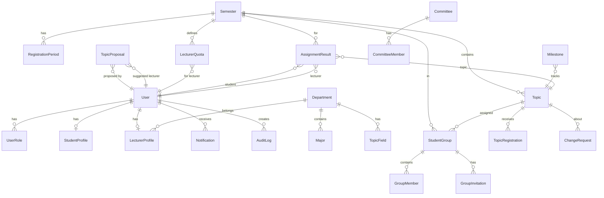

### Nhóm chức năng → Entity mapping

| Nhóm chức năng | Entities liên quan |
|----------------|-------------------|
| **Xác thực** | User, UserRole, RefreshToken |
| **Tổ chức** | Department, Major, Semester, RegistrationPeriod |
| **Đề tài** | Topic, TopicField, TopicProposal |
| **Đăng ký** | TopicRegistration, Registration |
| **Nhóm SV** | StudentGroup, GroupMember, GroupInvitation |
| **Phân công** | AssignmentResult, LecturerQuota |
| **Tiến độ** | Milestone |
| **Hội đồng** | Committee, CommitteeMember |
| **Thay đổi** | ChangeRequest |
| **Hệ thống** | Notification, AuditLog, SystemConfig |

---

## 7. Design System

### Color Palette

| Token | Hex | Sử dụng |
|-------|-----|---------|
| `--primary` | `#1677ff` | Buttons, links, active states |
| `--primary-light` | `#4096ff` | Hover, gradients |
| `--primary-bg` | `#e6f4ff` | Card backgrounds |
| `--success` | `#52c41a` | Approved, active |
| `--warning` | `#faad14` | Pending, alerts |
| `--error` | `#ff4d4f` | Rejected, errors |
| `--sidebar-bg` | `#001529` | Sidebar dark |
| `--bg-layout` | `#f5f5f5` | Page background |

### Typography

| Element | Style |
|---------|-------|
| H1 | Inter, 28px, weight 600 |
| H2 | Inter, 22px, weight 600 |
| Body | Inter, 14px, weight 400 |
| Caption | Inter, 12px, weight 400 |

### Status Tag Colors

| Status | Color | Label |
|--------|-------|-------|
| Published/Open | 🔵 Blue | "Đang mở" |
| Draft | ⚪ Default | "Nháp" |
| Pending | 🟡 Gold | "Chờ duyệt" |
| Active | 🔵 Blue | "Đang xử lý" |
| Approved | 🟢 Green | "Đã duyệt" |
| Rejected | 🔴 Red | "Từ chối" |
| FinalApproved | 🟢 Green | "Phê duyệt cuối" |
| Withdrawn | ⚪ Default | "Đã rút" |
| Closed | ⚪ Default | "Đã đóng" |
| Cancelled | 🔴 Red | "Đã hủy" |

### Component Library (Ant Design 5)

| Component | Sử dụng tại |
|-----------|-------------|
| `Table` | User Management, Registrations, Topics, Audit Log |
| `Card + Statistic` | Dashboards (stat cards) |
| `Steps` | Gale-Shapley wizard, Registration timeline |
| `Modal` | Create/Edit forms, Confirm dialogs |
| `Drawer` | User detail, Topic create form |
| `Tabs` | Topic detail, Reports |
| `Tag` | Status badges |
| `Select` | Filters, Role switcher |
| `DatePicker` | Semester/Period management |
| `Progress` | Quota bars, Slot indicators |
| `Badge` | Notification count |
| `Timeline` | Registration aspirations |
| `Collapse` | System Config categories |
| `Upload` | Excel import |

---

## 📊 Tổng kết: Số liệu hệ thống

| Metric | Count |
|--------|-------|
| **Tổng screens** | 30+ |
| **Roles** | 5 (Student, Lecturer, DeptHead, CBK, Admin) |
| **API Controllers** | 22 |
| **Domain Entities** | 26 |
| **Enums** | 14 |
| **Business Flows** | 7 luồng chính |
| **Background Jobs** | 3 (Auto-close periods, Expire invitations, Reminders) |

> [!TIP]
> Nếu bạn cần tôi đi sâu hơn vào bất kỳ luồng nghiệp vụ nào, hoặc muốn tôi tạo mockup hình ảnh cho từng màn hình cụ thể, hãy cho tôi biết!
